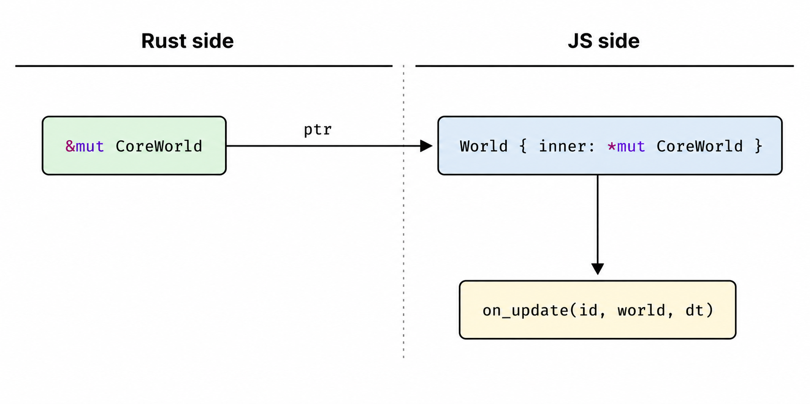
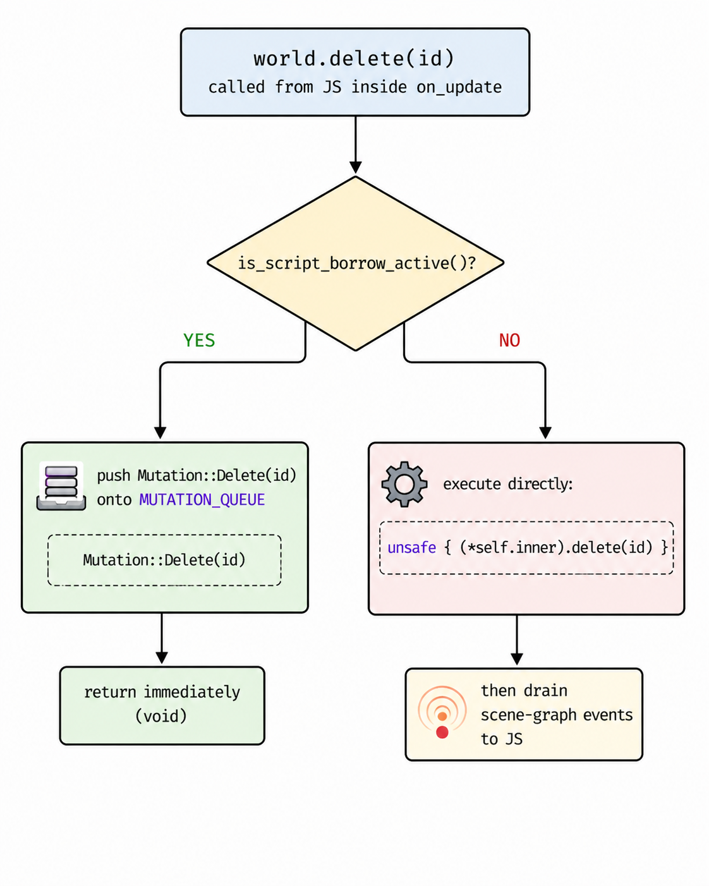
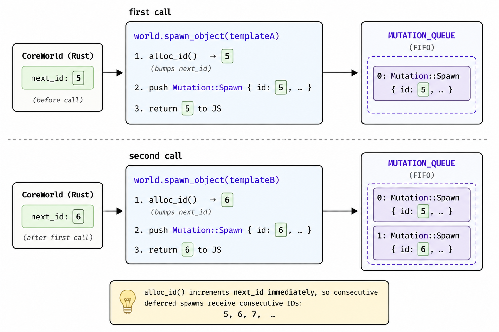

# World Mutations in Vertra

This document explains how Vertra's WASM binder handles world mutations that
arrive during a script callback, a scenario that would otherwise cause
undefined behaviour via aliased mutable pointers.

---

## Background: the aliased-pointer problem

The core engine exposes a `World` type (`vertra::world::World`) that owns all
scene objects.  When the binder invokes a JS script callback it passes a raw
`*mut World` wrapped in a thin WASM proxy:


For the entire duration of the callback Rust holds an **exclusive** `&mut
CoreWorld`.  If the JS callback calls back into WASM, for example
`world.delete(id)`, the binder would dereference the same raw pointer to
create a *second* `&mut CoreWorld`, producing aliased mutable references.
That is **undefined behaviour** regardless of whether the engine is
single-threaded.

---

## Solution: deferred mutation queue

Instead of executing world mutations inline (or throwing a runtime error),
every mutating binder method checks a thread-local flag called
`SCRIPT_BORROW_ACTIVE`.



The JS caller is unblocked immediately and the mutation is applied the moment
the callback returns, effectively zero latency from the user's perspective.

---

## The `Mutation` enum

All four mutating operations are represented as variants of a single enum
(defined in `binder/src/internals/mutation.rs`):

```rust
pub enum Mutation {
    Spawn {
        id:     usize,          // pre-allocated by alloc_id()
        object: CoreObject,
        parent: Option<usize>,
    },
    Delete(usize),
    Reparent { id: usize, new_parent: Option<usize> },
    Rename    { id: usize, new_str_id: String },
    // ... and other mutation types as needed
}
```

---

## Lifecycle of a deferred mutation

### 1. Script callback begins (`script_borrow_enter`)

Called by `JsObjectScript::on_start / on_update / on_fixed_update` in
`binder/src/script.rs` just before the JS function is invoked.

```rust
SCRIPT_BORROW_ACTIVE.with(|c| c.set(true));
```

### 2. JS callback runs

The JS function may call any combination of `world.spawn_object`,
`world.delete`, `world.reparent`, and `world.rename_str_id` on the `World`
proxy.  Each of those binder methods sees `SCRIPT_BORROW_ACTIVE == true` and
pushes a `Mutation` value onto `MUTATION_QUEUE` instead of touching the live
world.

#### Special case: `spawn_object` needs to return an ID

`spawn_object` must return a `usize` so JS can use the new object's ID
immediately (e.g. to attach a script or set up a parent relationship).  To
allow this while still deferring the actual insertion, the binder calls
`CoreWorld::alloc_id()` **synchronously**, bumping the world's `next_id`
counter and returning the reserved value before pushing the `Mutation::Spawn`
onto the queue:

```rust
// in World::spawn_object (binder)
let pre_id   = unsafe { (*self.inner).alloc_id() };   // bumps next_id
let core_obj = unsafe { (*object.inner).clone() };
queue_mutation(Mutation::Spawn { id: pre_id, object: core_obj, parent });
return pre_id;   // JS receives a valid, future ID
```

Because `alloc_id` increments `next_id` immediately, two consecutive deferred
spawns in the same callback receive consecutive IDs:




For `reparent` and `rename_str_id` (both of which return `bool`), the binder
returns `true` **optimistically**.  The actual success/failure is determined
when the mutation is flushed.

### 3. Script callback returns

`script_borrow_exit(world_ptr)` is called with the same `*mut CoreWorld` that
was passed into the callback.  The Rust `&mut CoreWorld` borrow is still live
at this point, but `SCRIPT_BORROW_ACTIVE` is cleared first so that the flush
pass executes normally (not deferred):

```rust
pub fn script_borrow_exit(world_ptr: *mut CoreWorld) {
    SCRIPT_BORROW_ACTIVE.with(|c| c.set(false));   // 1. clear guard
    flush_mutations(world_ptr);                     // 2. apply queue
    drain_scene_graph_events();                     // 3. fire JS events (wasm32 only)
}
```

### 4. `flush_mutations`

Drains `MUTATION_QUEUE` in FIFO order and applies each entry to the live world:

```rust
pub fn flush_mutations(world_ptr: *mut CoreWorld) {
    let mutations = MUTATION_QUEUE.with(|q| std::mem::take(&mut *q.borrow_mut()));
    if mutations.is_empty() { return; }             // null-pointer safe fast path

    let world = unsafe { &mut *world_ptr };
    for m in mutations {
        match m {
            Mutation::Spawn { id, object, parent } => world.insert_spawned(id, object, parent),
            // ... other mutation types
        }
    }
}
```

FIFO ordering means a script can do:

```js
const parentId = world.spawn_object(parentTemplate);      // queued as Spawn{id:5}
const childId  = world.spawn_object(childTemplate, parentId); // queued as Spawn{id:6}
world.reparent(childId, parentId);                        // queued as Reparent{id:6, new_parent:5}
```

When flushed, `parentId` (5) is inserted first, so the child's parent
reference is valid by the time the child's spawn is processed.

### 5. Scene-graph events (`drain_scene_graph_events`)

Structural world operations (`insert_spawned`, `delete`, `reparent`) fire
`on_scene_graph_modified` callbacks during the flush.  Those callbacks push
`SceneGraphModifiedEvent` values onto a second thread-local queue
(`SCENE_GRAPH_QUEUE`) instead of calling the JS handler immediately.  The
events are dispatched to JS only after `flush_mutations` returns, i.e. after
the `*mut CoreWorld` borrow has been fully released. This will eliminate any
possibility of re-entrant aliasing.

---

## Thread-local state summary

| Name                   | Type                         | Purpose                                      |
|------------------------|------------------------------|----------------------------------------------|
| `SCRIPT_BORROW_ACTIVE` | `Cell<bool>`                 | Guards mutation methods during callbacks     |
| `MUTATION_QUEUE`       | `RefCell<Vec<Mutation>>`     | Deferred mutations buffered during a callback|
| `SCENE_GRAPH_CB`       | `RefCell<Option<Function>>`  | Registered JS scene-graph callback (wasm32) |
| `SCENE_GRAPH_QUEUE`    | `RefCell<Vec<…Event>>`       | Pending scene-graph events (wasm32)          |

All four are `thread_local!`.  On WASM (single-threaded) there is exactly one
thread, so there is no sharing between threads.  On native (used only for
`cargo test`) each test thread gets its own copy; tests call `reset_test_state`
at their start to clear any leftover values from a previous test on the same
thread.

---

## Core-world additions

Two methods were added to `vertra::world::World` to support the deferred-spawn
path:

### `alloc_id(&mut self) -> usize`

Increments `next_id` and returns the reserved value without inserting any
object.  Guarantees that a future call to `spawn_object` or `insert_spawned`
with that ID will not collide with any automatically-allocated ID.

### `insert_spawned(id, object, parent_id)`

Performs the full parent/child/roots link-up and fires `on_scene_graph_modified`
for a pre-allocated `id`.  `spawn_object` is now a thin wrapper:

```rust
pub fn spawn_object(&mut self, object: Object, parent_id: Option<usize>) -> usize {
    let id = self.alloc_id();
    self.insert_spawned(id, object, parent_id);
    id
}
```
---

## Design trade-offs

| Concern | Decision |
|---|---|
| **Spawn must return an ID** | Pre-allocate via `alloc_id` so the JS caller gets a valid future ID synchronously |
| **Reparent/rename return bool** | Return `true` optimistically; the actual outcome is determined on flush |
| **FIFO vs LIFO ordering** | FIFO guarantees that a parent spawned before its child is inserted first |
| **Null-pointer safety** | `flush_mutations` short-circuits before dereferencing when the queue is empty; `script_borrow_exit` with an empty queue is always safe even with a null pointer |
| **Panic safety** | The queue is drained with `mem::take` before the loop; a panicking mutation leaves a partial world but cannot leave the queue in a half-consumed state |
| **Thread-local isolation in tests** | `reset_test_state()` resets both `SCRIPT_BORROW_ACTIVE` and `MUTATION_QUEUE` |

